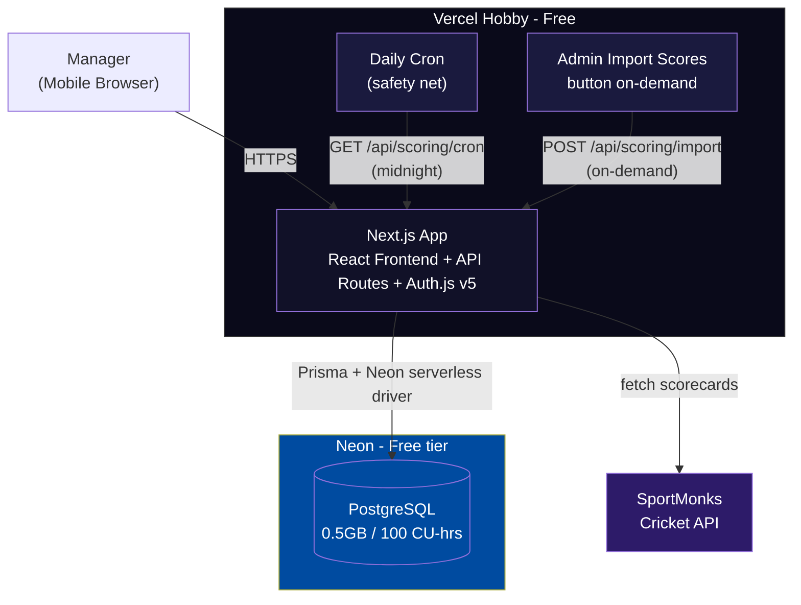
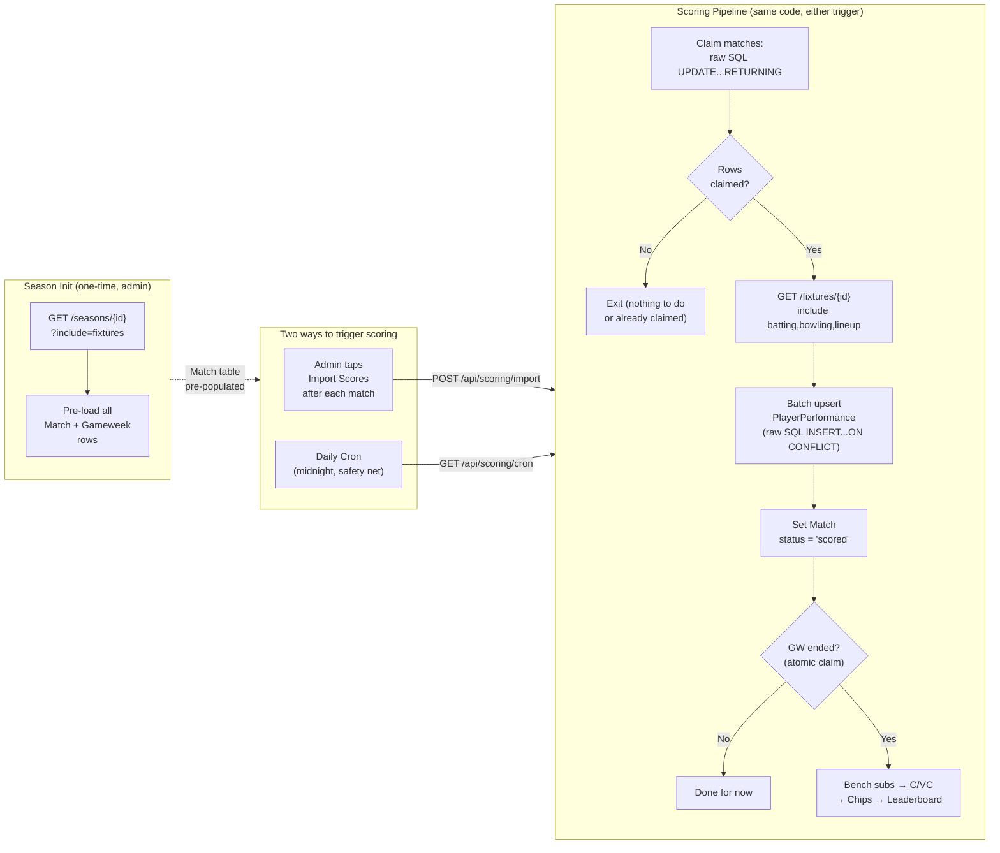

# FAL — High-Level Architecture

## 1. Architecture Overview (Phase 1)

### Monolithic Next.js:
- Single Next.js app on Vercel
- API routes for backend logic
- React frontend (mobile-first)
- PostgreSQL (Neon) + Prisma ORM
- Auth.js v5 for authentication (OAuth + credentials)
- Vercel Cron for match data polling

### Tech Stack:
| Layer | Technology |
|---|---|
| Frontend | Next.js + React + TypeScript |
| Styling | Tailwind CSS |
| Backend | Next.js API Routes |
| Database | Neon PostgreSQL (free tier — 0.5GB, 100 compute-hrs/mo) |
| ORM | Prisma (with `@prisma/adapter-neon` + `@neondatabase/serverless`) |
| Auth | Auth.js v5 (OAuth + credentials) |
| Cricket Data | SportMonks API (€29/mo Major plan) |
| Deployment | Vercel (Hobby — free) |
| Cron | Vercel Cron (daily, 1 job on Hobby) + admin-triggered API routes |

### Platform Constraints:
- **Vercel Hobby plan:** 1 cron job (daily max), function duration max 60s, 4.5MB response body, non-commercial use only.
- **Neon free tier:** 0.5GB storage, 100 compute-hrs/mo, 10K pooled connections. Auto-suspends after 5 min idle (~1-3s cold start).

### System Architecture



### Scoring Pipeline Flow



## 2. Core Services

All services run within the Next.js monolith as modules in `lib/`:

1. **Match Import Service** (`lib/sportmonks/`) — Fetches scorecards from SportMonks API
2. **Stat Parser** (`lib/scoring/batting.ts`, `bowling.ts`, `fielding.ts`) — Extracts and computes player performance stats
3. **Fantasy Points Engine** (`lib/scoring/pipeline.ts`) — Applies scoring rules, calculates base points per match
4. **Gameweek Aggregator** (`lib/scoring/multipliers.ts`) — Bench subs, C/VC multipliers, chip effects, team totals
5. **Leaderboard Service** (in API routes) — Rankings, season totals, history
6. **Lineup Validation Service** (`lib/lineup/`) — Squad size, player uniqueness, lineup lock timing, role constraints

## 3. Database Entities

- **User** — Platform user (auth). Stores `email`, `name`, `image`, `role` (enum: `USER`/`ADMIN` — platform admin for scoring/season ops vs regular manager).
- **League** — Fantasy competition container. Stores `adminUserId` (creator/league admin), `inviteCode`, `name`, settings.
- **Team** — Manager's team within a league. Stores `name`, `totalPoints` (incremental — updated at GW end, avoids full re-aggregation for leaderboard).
- **TeamPlayer** — Join table: which Player belongs to which Team. Stores `purchasePrice` (from admin CSV upload). Enforces uniqueness within a league.
- **Player** — Real IPL player (from API). Stores `apiPlayerId` (SportMonks ID), `fullname`, `iplTeamId`, `role` (BAT/BOWL/ALL/WK), `battingStyle`, `bowlingStyle`, `imageUrl`.
- **Gameweek** — Global weekly scoring period (Mon–Sun). Stores `number` (1-10), `lockTime` (DateTime — earliest `starting_at` of matches in this GW), `status` (enum: `upcoming`/`active`/`completed`), `aggregationStatus` (enum: `pending`/`aggregating`/`done` — atomic lock for GW-end processing).
- **Match** — An IPL match within a gameweek. Stores `apiMatchId` (SportMonks fixture ID), `localTeamId`, `visitorTeamId`, `startingAt`, `apiStatus` (raw from SportMonks: `NS`/`Finished`/`Cancelled`), `scoringStatus` (enum: `scheduled`/`completed`/`scoring`/`scored`/`error` — internal pipeline state), `note` (result text), `winnerTeamId`, `scoringAttempts` (Int, default 0 — for retry tracking).
- **Lineup** — Weekly lineup submission per team per gameweek.
- **LineupSlot** — Individual slot within a lineup. Stores: `playerId`, `slotType` (XI/BENCH), `benchPriority` (1-4, null for XI), `role` (CAPTAIN/VC/TRIPLE_CAPTAIN/null).
- **PlayerPerformance** — Per-player per-match stats AND computed fantasy points. Stores:
  - Batting: `runs`, `balls`, `fours`, `sixes`, `strikeRate`, `wicketId` (dismissal type)
  - Bowling: `overs`, `maidens`, `runsConceded`, `wickets`, `economyRate`, `dotBalls` (computed from ball-by-ball if enabled)
  - Fielding: `catches`, `stumpings`, `runoutsDirect`, `runoutsAssisted`
  - Computed: `fantasyPoints` (Int — base points for this match, before C/VC/chip multipliers)
  - Meta: `inStartingXI` (boolean), `isImpactPlayer` (boolean)
- **PlayerScore** — Aggregated fantasy points per player per gameweek (sum of `PlayerPerformance.fantasyPoints` across matches in the GW, after C/VC multipliers and chip effects).
- **ChipUsage** — Which chip a team used in which gameweek. Stores `teamId`, `chipType` (enum: `TRIPLE_CAPTAIN`/`BENCH_BOOST`/`BAT_BOOST`/`BOWL_BOOST`), `gameweekId`, `status` (enum: `pending`/`used` — `pending` before lock, `used` after GW scoring; delete row on deactivation before lock).

### Entity Relationships:
User 1→N Team, League 1→N Team, Team 1→N TeamPlayer, Player 1→N TeamPlayer, Team 1→N Lineup, Lineup 1→N LineupSlot, Gameweek 1→N Match, Match 1→N PlayerPerformance, PlayerPerformance N→1 Player.

### Uniqueness Constraints:
- `TeamPlayer`: unique(`leagueId`, `playerId`) — a player can only be on one team per league
- `Lineup`: unique(`teamId`, `gameweekId`) — one lineup per team per gameweek
- `ChipUsage`: unique(`teamId`, `chipType`) — each chip used once per season
- `LineupSlot`: unique(`lineupId`, `playerId`) — a player appears once per lineup

### Required Indexes:
- `Match(scoringStatus)` — optimistic lock claim query
- `Match(gameweekId, scoringStatus)` — GW-end "all matches scored?" check
- `PlayerPerformance(playerId, matchId)` — upsert key + per-match lookups
- `PlayerPerformance(matchId)` — fetch all performances for a match
- `Player(role, iplTeamId)` — player search/filter API
- `Team(leagueId)` — leaderboard queries
- `Gameweek(status)` — current GW lookup

## 4. API Routes (Phase 1)

All routes require authentication via Auth.js session unless noted. Routes marked **(platform admin)** require `User.role === 'ADMIN'`. Routes marked **(league admin)** require `league.adminUserId === session.userId`. Routes marked **(owner)** require `team.userId === session.userId`.

**Error responses** (standard across all routes):
- `401` — Not authenticated (no valid session)
- `403` — Forbidden (not admin/owner for this resource)
- `404` — Resource not found
- `409` — Conflict (e.g., chip already used, player on another team, pipeline already running)
- `422` — Validation failure (e.g., invalid lineup, lock in effect)
- `423` — Locked (lineup lock in effect, no edits allowed)

### Auth:
- `GET/POST /api/auth/[...nextauth]` — Auth.js v5 handler (public)

### Leagues:
- `POST /api/leagues` — Create league (caller becomes league admin)
- `GET /api/leagues` — List leagues the current user belongs to
- `GET /api/leagues/[id]` — League detail: settings, invite code, manager list **(member)**
- `GET /api/leagues/[id]/teams` — List all teams in the league with manager names **(member)**
- `POST /api/leagues/[id]/join` — Join via invite code (returns 409 if league full)
- `PUT /api/leagues/[id]/settings` — Update league settings **(league admin)**
- `DELETE /api/leagues/[id]/managers/[userId]` — Remove a manager and their team **(league admin)**

### Teams:
- `GET /api/teams/[teamId]` — Team detail: name, manager, squad size **(owner or league member)**
- `GET /api/teams/[teamId]/squad` — List players on this team **(owner or league member)**
- `POST /api/leagues/[id]/roster` — Upload roster CSV for all teams **(league admin)**

### Lineups:
- `GET /api/teams/[teamId]/lineups/[gameweekId]` — Get lineup (playing XI, bench order, captain, VC, chip) **(owner)**
- `PUT /api/teams/[teamId]/lineups/[gameweekId]` — Submit/update lineup (upsert). Returns 423 if locked **(owner)**
- `POST /api/teams/[teamId]/lineups/[gameweekId]/chip` — Activate chip. Returns 409 if already used this season, 423 if locked **(owner)**
- `DELETE /api/teams/[teamId]/lineups/[gameweekId]/chip` — Deactivate chip before lock **(owner)**

### Scoring:
- `GET /api/leagues/[leagueId]/scores/[gameweekId]` — Gameweek scores for all teams in a league **(member)**
- `GET /api/teams/[teamId]/scores/[gameweekId]` — Detailed score breakdown for a single team **(owner or league member)**
- `POST /api/scoring/import` — Trigger match import + scoring pipeline **(platform admin)**
- `GET /api/scoring/cron` — Vercel cron trigger (same pipeline, protected by `CRON_SECRET`) **(cron only)**
- `POST /api/scoring/recalculate/[matchId]` — Reset match to `completed` and re-score **(platform admin)**
- `POST /api/scoring/cancel/[matchId]` — Set match to `cancelled` **(platform admin)**
- `POST /api/scoring/force-end-gw/[gameweekId]` — Force GW aggregation **(platform admin)**
- `GET /api/scoring/status` — List matches with `scoringStatus` **(platform admin)**

### Season Admin:
- `POST /api/admin/season/init` — Import IPL fixture list from SportMonks, create Match + Gameweek rows **(platform admin, one-time per season)**

### Leaderboard:
- `GET /api/leaderboard/[leagueId]` — Current league standings (total points, rank, GW points) **(member)**
- `GET /api/leaderboard/[leagueId]/history` — Gameweek-by-gameweek points per team **(member)**

### Players:
- `GET /api/players?role=BAT&team=MI&page=1&limit=25` — Search/filter players with pagination **(authenticated)**
- `GET /api/players/[id]` — Player detail: name, role, IPL team, current season stats **(authenticated)**

### Gameweeks:
- `GET /api/gameweeks/current` — Current gameweek info (number, lock time, matches, status) **(authenticated)**
- `GET /api/gameweeks` — List all gameweeks with status and match counts **(authenticated)**

## 5. Scoring Pipeline

### Hybrid Scoring Strategy (Hobby-compatible)

**Primary:** Admin taps "Import Scores" → `POST /api/scoring/import`
**Safety net:** Daily cron at midnight → `GET /api/scoring/cron` (Vercel sends GET)

```json
// vercel.json
{
  "crons": [{
    "path": "/api/scoring/cron",
    "schedule": "0 0 * * *"
  }]
}
```

### Pipeline Flow (`runScoringPipeline()` in `lib/scoring/pipeline.ts`)

```
1. Early exit: if any match has scoringStatus = 'scoring', return 409

2. Claim matches (raw SQL $queryRaw — NOT Prisma update()):
   UPDATE "Match" SET "scoringStatus" = 'scoring'
     WHERE "scoringStatus" = 'completed'
     ORDER BY "startingAt" ASC LIMIT 4
     RETURNING id

3. For each claimed match (try/catch):
   try {
     a. GET /fixtures/{id}?include=batting,bowling,lineup[,balls] (10s timeout)
     b. Validate response shape
     c. Parse batting → stats + fielding attribution
     d. Parse bowling → stats (+ dot balls in-memory if enabled)
     e. Compute fantasyPoints per player (base, no multipliers)
     f. Batch upsert via raw SQL INSERT...ON CONFLICT (~30 players, 1 statement)
     g. Set Match.scoringStatus = 'scored'
   } catch {
     h. Reset to 'completed', increment scoringAttempts
     i. If attempts >= 3 → set 'error'
   }

4. GW end check (atomic lock):
   UPDATE "Gameweek" SET "aggregationStatus" = 'aggregating'
     WHERE id = ? AND "aggregationStatus" = 'pending'
     AND NOT EXISTS (SELECT 1 FROM "Match" WHERE "gameweekId" = ?
       AND "scoringStatus" NOT IN ('scored', 'error', 'cancelled'))
     RETURNING id

5. If GW claimed:
   a. Aggregate player points across GW matches
   b. Bench auto-substitutions
   c. Captain/VC multipliers
   d. Chip effects
   e. Incremental leaderboard: UPDATE "Team" SET "totalPoints" += gwPoints
   f. Set Gameweek.aggregationStatus = 'done'
```

### Match.scoringStatus State Machine
```
scheduled → completed → scoring → scored
                ↑           |         |
                |    (fail) ↓         |
                ←── (retry) ←─────────┘ (re-score)
                         ↓
                    error (after 3 attempts)
                         ↓
                    cancelled (admin action)
```

### Timing Budget
| Step | Time |
|---|---|
| Vercel + Neon cold start | ~2-4s |
| SportMonks API call | ~1-2s/match |
| Parse + compute | <100ms |
| Batch SQL upsert | ~100ms |
| GW aggregation | ~2-3s |
| **4 matches + GW end** | **~25-35s** (within 60s) |

## 6. Hosting & Cost

### Monthly Cost (IPL Season)
| Service | Cost |
|---|---|
| Vercel Hobby | $0 |
| Neon PostgreSQL | $0 |
| SportMonks Major | €29/mo (~$31) |
| Auth.js | $0 |
| **Total** | **~$31/mo** |

### Annual: ~$62-74/yr (cancel SportMonks off-season)

## 7. Future Architecture (Phase 2+)

- **Auction Engine:** Real-time WebSocket bidding, $100M budget, 10s timer
- **Mid-Season Auction:** After 30 matches, sell back at 90% market value
- **Market System:** Dynamic pricing, price history graphs
- **Engagement:** Power rankings, analytics, AI lineup suggestions

## Related Documents
- [Design Spec](2026-03-15-fal-design.md) — Scoring rules, chips, lineup mechanics, UI designs
- [API Exploration](2026-03-22-sportmonks-api-exploration.md) — SportMonks field validation, gap analysis
- [Implementation Plan](2026-03-22-fal-implementation-plan.md) — Local setup, project structure, deployment
